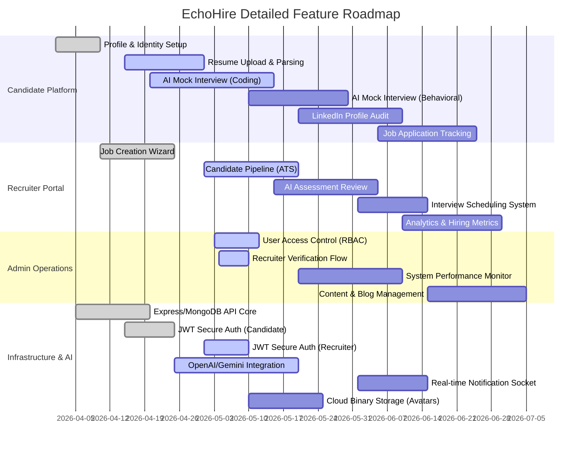

# EchoHire Frontend Guide

This guide helps team members quickly find files and know where to edit features.

## Run Project

From `frontend/`:

```bash
npm install
npm run dev
```

Open `http://localhost:3000`.

## Tech Stack

- Next.js (App Router)
- TypeScript
- Tailwind CSS
- React Icons

## Folder Map (Important)

- `app/` -> all routes/pages
- `components/` -> reusable UI components
- `app/globals.css` -> global styles

## Main Pages

- Home: `app/page.tsx`
- Pricing: `app/pricing/page.tsx`
- Auth (sign in / sign up): `app/auth/page.tsx`
- Dashboard: `app/dashboard/page.tsx`
- AI Interview: `app/ai-interview/page.tsx`
- Resume Analyzer: `app/resume-analyzer/page.tsx`
- LinkedIn Optimizer: `app/linkedin-optimizer/page.tsx`
- Profile: `app/profile/page.tsx`
- Settings: `app/settings/page.tsx`
- Support: `app/support/page.tsx`
- About EchoHire: `app/about-echohire/page.tsx`

## Shared Components (High Impact)

- Navbar: `components/Navbar.tsx`
- Dashboard Sidebar: `components/DashboardSidebar.tsx`
- Hero section: `components/Hero.tsx`
- Footer: `components/Footer.tsx`

## "Where to change what"

### Login flow / redirect

- File: `app/auth/page.tsx`
- Login button currently goes to:
  - `/dashboard?completeProfile=1`

### "Complete profile" alert after login

- File: `app/dashboard/page.tsx`
- Reads `completeProfile=1` from URL and shows a prompt card.

### Logout button location

- Desktop + mobile navbar logout:
  - `components/Navbar.tsx`
- Sidebar logout menu item:
  - `components/DashboardSidebar.tsx`

### Profile details form (user data)

- File: `app/profile/page.tsx`
- Stores profile data in localStorage key:
  - `echohire-profile`

### Profile avatar / name in navbar

- File: `components/Navbar.tsx`
- Reads profile info from localStorage key:
  - `echohire-profile`

### Sidebar menu links and active states

- File: `components/DashboardSidebar.tsx`

### Mobile navbar drawer

- File: `components/Navbar.tsx`

### Mobile sidebar drawer

- File: `components/DashboardSidebar.tsx`

### Logo tap behavior (custom)

- File: `components/Navbar.tsx`
- Logo click alternates route in session:
  - first tap -> `/`
  - second tap -> `/about-echohire`

## Add a New Page

1. Create route: `app/<new-page>/page.tsx`
2. Add link in sidebar or navbar:
   - sidebar -> `components/DashboardSidebar.tsx`
   - navbar -> `components/Navbar.tsx`
3. Add quick access from home if needed:
   - `app/page.tsx`

## Design Consistency Rules

- Primary dark background: `#050b18`
- Card background: `#0d162a`
- Border color: `#243253`
- Primary accent gradient: `from-[#2a7df7] to-[#372e8f]`

## Notes for Partners

- Frontend is currently UI-focused (no backend auth yet).
- Most personalization is localStorage-based for now.
- Before pushing changes, run:

```bash
npm run lint
```
## Project Roadmap



